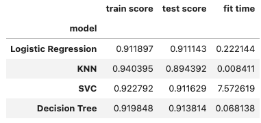

# Bank Marketing Campaigns

The notebook "prompt_III" contains my work for this project. The following readme reiterates the information therein.

## Problem 1: Understanding the Data
To gain a better understanding of the data, please read the information provided in the UCI link above, and examine the Materials and Methods section of the paper. How many marketing campaigns does this data represent?

> 43

## Problem 2: Read in the Data
Use pandas to read in the dataset bank-additional-full.csv and assign to a meaningful variable name.

> `df = pd.read_csv('data/bank-additional-full.csv', sep = ';')`

## Problem 3: Understanding the Features¶
Examine the data description below, and determine if any of the features are missing values or need to be coerced to a different data type.

> There is no missing data, though the object features will have to change in preprocessing and the numeric features will need to be scaled.

## Problem 4: Understanding the Task
After examining the description and data, your goal now is to clearly state the Business Objective of the task. State the objective below.

> The goal is to build a model for what qualities in a targeted consumer contribute toa successful marketing campaign. The feature "y" denotes if a customer purchasedthe marketed product and the other features should be considered for their abilityto predict that outcome.

## Problem 5: Engineering Features
Now that you understand your business objective, we will build a basic model to get started. Before we can do this, we must work to encode the data. Using just the bank information features, prepare the features and target column for modeling with appropriate encoding and transformations.

> `preprocessed = pd.DataFrame(preprocessed_data, columns=feature_names)`

## Problem 6: Train/Test Split
With your data prepared, split it into a train and test set.

> `X_train, X_test, y_train, y_test = train_test_split(X, y, test_size=0.2, random_state=42)`

## Problem 7: A Baseline Model
Before we build our first model, we want to establish a baseline. What is the baseline performance that our classifier should aim to beat?

> `dummy_classifier = DummyClassifier(strategy='most_frequent').fit(X_train, y_train)`

## Problem 8: A Simple Model
Use Logistic Regression to build a basic model on your data.

> `logreg = LogisticRegression()`

## Problem 9: Score the Model
What is the accuracy of your model?

> `lr_test_score = logreg.score(X_test, y_test)`

## Problem 10: Model Comparisons
Now, we aim to compare the performance of the Logistic Regression model to our KNN algorithm, Decision Tree, and SVM models. Using the default settings for each of the models, fit and score each. Also, be sure to compare the fit time of each of the models.

> 

## Problem 11: Improving the Model
Now that we have some basic models on the board, we want to try to improve these. Below, we list a few things to explore in this pursuit.

- More feature engineering and exploration. For example, should we keep the gender feature? Why or why not?
- Hyperparameter tuning and grid search. All of our models have additional hyperparameters to tune and explore. For example the number of neighbors in KNN or the maximum depth of a Decision Tree.
- Adjust your performance metric

> The grids I used for each model sometimes produced interesting variations on the initial models, but didn't vastly improve upon the initial models' scores. The greatest improvement was for logistic regression, where the score moved from 0.9111 to 0.9175 by using a C value of 0.01 and l2 as the penalty. This shift is so modest that I suspect further experimentation with hyperparameters or perhaps better preprocessing of the data could yield superior results.
